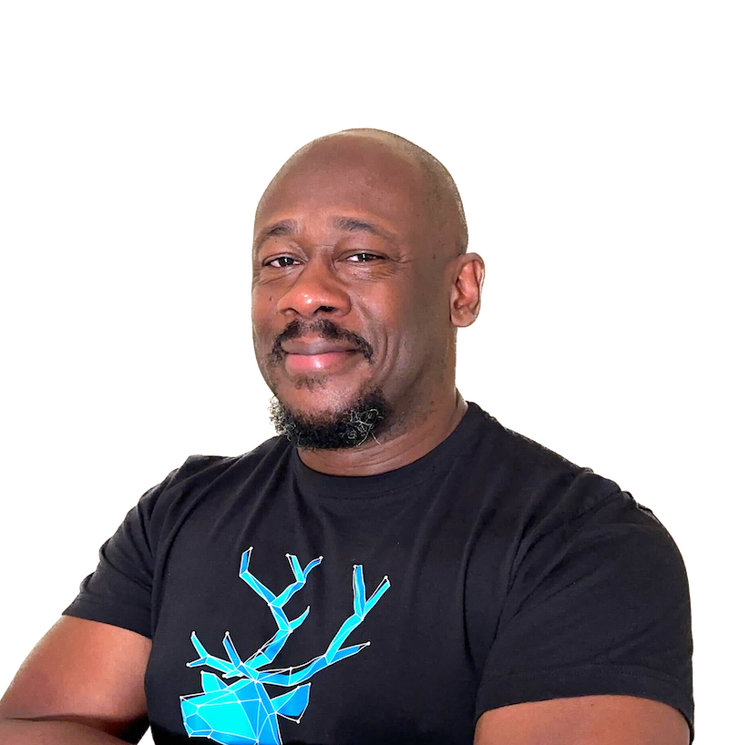

# Lawrence Lockhart speaker profile

## Bio
Lawrence Lockhart is a Developer Advocate at Vaadin where he shares the latest solutions to app development for Java developers. With over 20 years professional experience in Supply Chain, Hospitality Management, and tech, Lawrence leverages this experience into always keeping a customer-first approach to solving business problems. A lifelong learner himself, Lawrence takes great pride investing his personal time helping future techies in their career paths from his role as Senior Advisor to Code Connector to Brand Ambassador at Karat/BBM. When he's not wearing his tech hat, Lawrence enjoys cooking and spending time with family, gaming on the Meta Quest 2, and attending local church services.

## Social Media
- [Twitter](https://twitter.com/LawrenceDCodes)
- [LinkedIn](https://linkedin.com/in/lawrencelockhart)

## Headshot

